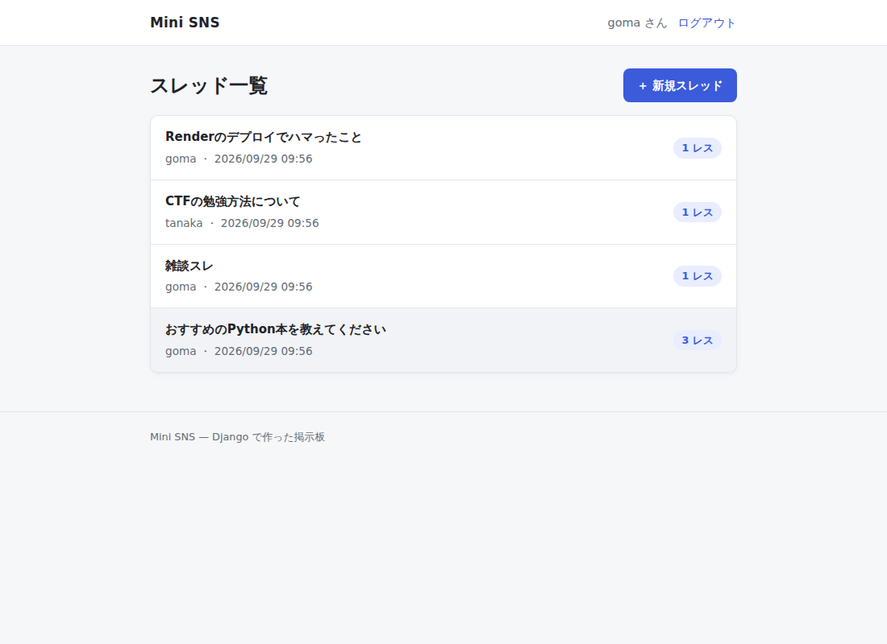
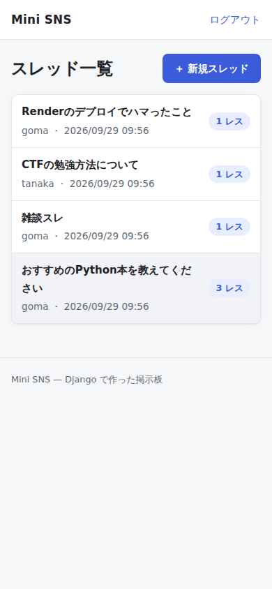
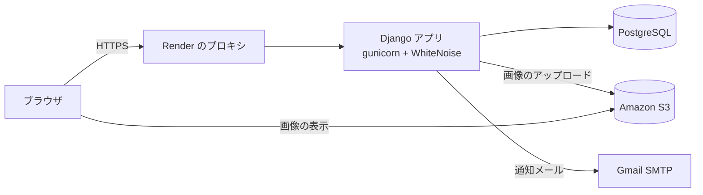
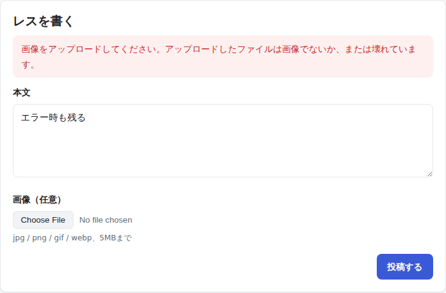

# Mini SNS

Django で作ったスレッド型の掲示板です。スレッドを立てて、本文や画像でレスをつけられます。

- 公開URL:  https://sns-project-rnvy.onrender.com/
- 閲覧はログインなしで可能、投稿にはユーザー登録が必要です

<p>
  
  
</p>

## 主な機能

| 機能 | 内容 |
|---|---|
| ユーザー登録・ログイン | Django 標準の認証を使用。パスワードは8文字以上、よく使われるものや数字だけのものは不可 |
| スレッド・レス | スレッドを立てて、本文か画像でレスを投稿。レスには通し番号がつく |
| 画像投稿 | jpg / png / gif / webp、5MB まで。保存先は Amazon S3 |
| ページ送り | スレッド一覧は20件、レスは100件ごと。投稿後は自分のレスの位置へ移動 |
| 管理者への通知 | 新規登録・スレ立て・レス・ログインの際に管理者へメールで通知 |
| 表示 | スマホ表示とダークモードに対応 |

## 技術スタック

- **バックエンド**: Python 3.11 / Django 5.2
- **DB**: PostgreSQL（本番）/ SQLite（ローカル）
- **画像の保存**: Amazon S3（django-storages）
- **ホスティング**: Render（gunicorn + WhiteNoise）
- **その他**: django-ratelimit、Pillow



## 工夫した点：セキュリティ

### 1. 画像アップロードの検証

**見つけた問題**：最初の実装では、モデルの画像フィールドにサイズと拡張子の検証関数を付けていましたが、保存に `Post.objects.create()` を使っていたため、検証が一度も実行されていませんでした。Django のモデルの validator は、フォームの `is_valid()` かモデルの `full_clean()` を呼んだときにしか動かないためです。その結果、HTML など任意のファイルを S3 に公開できる状態でした。

**対策**：フォーム（[`core/forms.py`](core/forms.py)）経由で保存するように変え、3段階で検証しています。

1. Pillow で、本当に画像として開けるかを確認する
2. 拡張子が jpg / jpeg / png / gif / webp か、サイズが 5MB 以下かを確認する
3. Pillow が判定した**実際の形式**が JPEG / PNG / GIF / WebP のどれかかを確認する

拡張子はファイル名を変えるだけで偽装できるので、最終的な判断は中身で行っています。拡張子だけ `.png` にした HTML や、中身が BMP のファイルも拒否されます。



### 2. レート制限

| 操作 | 上限 | 単位 |
|---|---|---|
| ログイン | 1分に5回 | IP アドレス **と** ユーザー名 |
| 新規登録 | 1時間に5回 | IP アドレス |
| スレ立て | 1分に10回 | ユーザー |
| レス | 1分に20回 | ユーザー |

- **Render 経由でのクライアント IP の取得**：Render ではリクエストがプロキシを通るため、`REMOTE_ADDR` はプロキシの IP になります。そのため `X-Forwarded-For` の先頭からクライアントの IP を取り出しています（[`core/utils.py`](core/utils.py)）。
- **IP の偽装への対策**：Render は、クライアントが送ってきた `X-Forwarded-For` に追記する形で IP を付けるため、ヘッダを書き換えれば IP を偽装できてしまいます。IP 単位の制限だけでは、ヘッダを毎回変えることで1つのアカウントへの総当たりをすり抜けられるので、偽装できない**ユーザー名単位の制限**を重ねています。
- **分かりやすいエラー表示**：`block=True` だと制限に掛かった時点で 403 になり、画面にメッセージが出ません。`block=False` にして、ビュー側で 429 とエラーメッセージを返しています。

### 3. そのほかの対策

- CSRF 対策（Django 標準）、XSS 対策（テンプレートの自動エスケープ）
- 本番環境では HTTPS へのリダイレクト、HSTS、Cookie の Secure 属性、`X-Frame-Options: DENY`
- 管理画面の URL を推測されにくいものに変更
- `SECRET_KEY` などの秘密情報は環境変数で管理し、本番で設定が無いときは起動しない

## 工夫した点：設計

- **スレッドの作成をトランザクションでまとめる**：スレッドと1レス目を `transaction.atomic` でまとめて作成し、画像の検証などで失敗したときに、空のスレッドが残らないようにしています。
- **N+1 問題の解消**：一覧でスレッドごとにレス数を数えると、スレッドの数だけクエリが発行されます。`annotate(Count("posts"))` と `select_related` を使い、1回のクエリで取得しています。
- **ローカルでも本番でもそのまま動く設定**：環境変数が無ければ、SQLite・ローカル保存・コンソールへのメール出力で起動します。Render 上では自動で本番用の設定に切り替わります（[`sns_project/settings.py`](sns_project/settings.py)）。

## テスト

```bash
python manage.py test core
```

23件のテストで、次のような内容を確認しています。

- 画像の検証（HTML の偽装、許可していない形式、5MB 超、正常な画像）
- レート制限（制限を超えたときのメッセージ、`X-Forwarded-For` を変えても同じユーザー名への総当たりが止まること）
- 閲覧と投稿の権限（ログインなしでは閲覧のみ可能）
- ページ送り（件数、ページをまたいだレス番号、不正なページ番号）
- 画像の検証に失敗したとき、スレッドが作られないこと

## ローカルでの起動

環境変数を設定しなくても起動できます。

```bash
python -m venv venv
source venv/bin/activate          # Windows: venv\Scripts\activate
pip install -r requirements.txt
python manage.py migrate
python manage.py createsuperuser  # 管理者ユーザー（任意）
python manage.py runserver
```

http://127.0.0.1:8000/ を開きます。

## 本番環境の設定（Render）

| 環境変数 | 用途 |
|---|---|
| `SECRET_KEY` | 必須。無いと起動しない |
| `DATABASE_URL` | PostgreSQL の接続 URL |
| `AWS_STORAGE_BUCKET_NAME` / `AWS_ACCESS_KEY_ID` / `AWS_SECRET_ACCESS_KEY` | 画像を S3 に保存する（未設定ならローカルに保存） |
| `EMAIL_HOST_USER` / `EMAIL_HOST_PASSWORD` | Gmail SMTP（未設定ならコンソールに出力） |
| `ADMIN_NOTIFY_EMAIL` | 管理者への通知の送信先（未設定なら通知しない） |

`RENDER` と `RENDER_EXTERNAL_HOSTNAME` は Render が自動で設定します。

## ディレクトリ構成

```
sns_project/        設定（settings.py, urls.py）
core/
  models.py         Thread（スレッド）と Post（レス）
  forms.py          投稿フォームと画像の検証
  views.py          画面の処理、レート制限
  utils.py          クライアント IP の取得、管理者への通知
  tests.py          テスト
  templates/core/   HTML テンプレート
  static/core/      CSS と JavaScript
```

## 今後の課題

- レート制限の回数をメモリ（プロセスごと）に保存しているので、サーバーを複数台にする場合は Redis などの共有キャッシュに移す
- 投稿の編集・削除と、管理者による通報対応の機能
- アップロードされた画像の縮小と、EXIF（位置情報などのメタデータ）の削除
